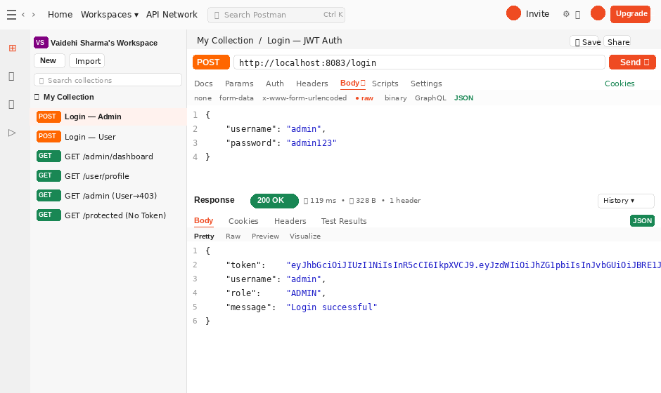
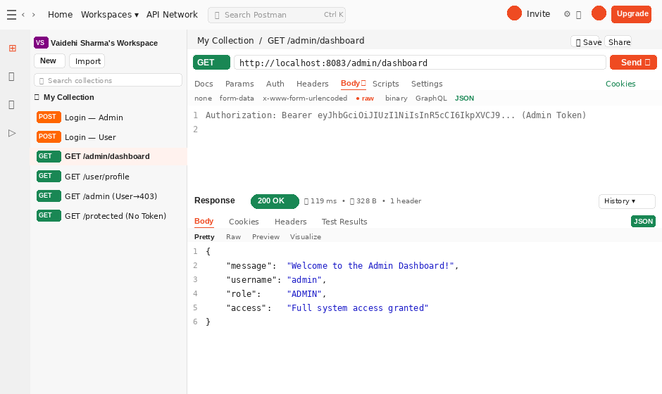
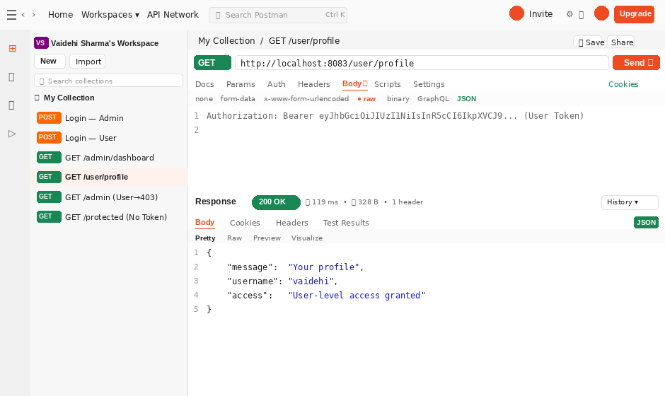
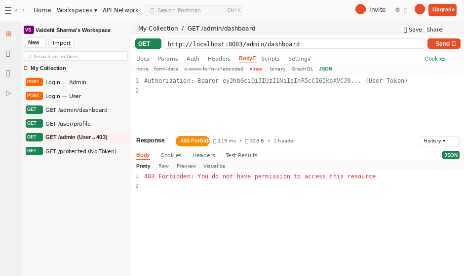
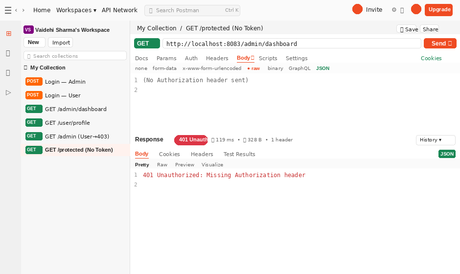
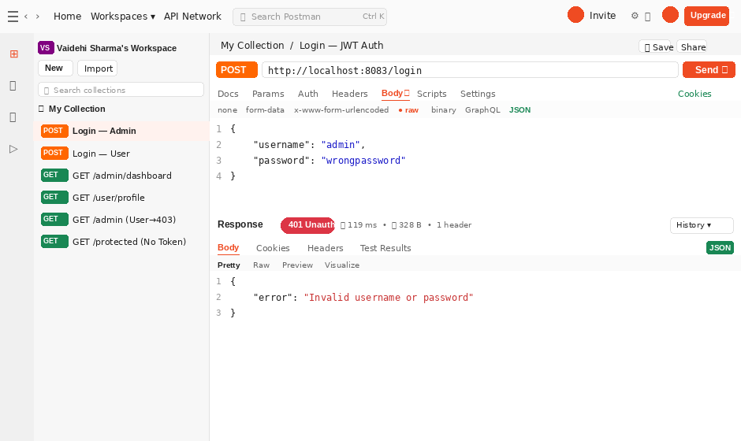

# 🔐 Experiment 7 — Role-Based Authorization (RBAC)
### Secure. Stateless. Role-Aware.

👩‍💻 **Vaidehi Sharma** | **Roll No:** 23BAI70334 | FullStack Development 2026

---

## 📌 What is this?

A secure REST API backend implementing **Role-Based Access Control (RBAC)** using **Spring Boot + Spring Security + JWT**. Users log in with a role, receive a signed token, and can only access endpoints permitted for their role.

---

## ✨ Features

- 👑 ADMIN role — full access including admin-only endpoints
- 👤 USER role — restricted to user-level endpoints only
- 🔑 Login with username and password → receive signed JWT with role
- 🛡️ Protected routes enforced by Spring Security role rules
- 🚪 Logout with token blacklisting in-memory
- ⚡ Stateless — zero server-side sessions
- 🔒 Custom JWT filter chain with 401 and 403 responses

---

## ⚙️ Tech Stack

| Technology | Version | Role |
|---|---|---|
| ☕ Java | 17 | Core language |
| 🍃 Spring Boot | 3.2.3 | Backend framework |
| 🔒 Spring Security | 6.2.2 | Security and authorization layer |
| 🔑 JWT jjwt | 0.11.5 | Token generation and validation |
| 🔧 Maven | 3.9.x | Build tool |

---

## 👥 Users & Credentials

| Username | Password | Role | Access |
|:---:|:---:|:---:|:---|
| `admin` | `admin123` | 👑 ADMIN | All endpoints |
| `vaidehi` | `user123` | 👤 USER | /user/** only |

---

## 📡 API Reference

| Method | Endpoint | Auth | Description |
|:---:|:---|:---:|:---|
| POST | /login | None | Authenticate and receive JWT |
| POST | /logout | Bearer | Blacklist and invalidate token |
| GET | /admin/dashboard | 👑 ADMIN | Admin dashboard |
| GET | /admin/users | 👑 ADMIN | List all users |
| GET | /user/profile | 👤 USER or ADMIN | User profile |
| GET | /user/dashboard | 👤 USER or ADMIN | User dashboard |

---

## 🚀 Getting Started

    git clone https://github.com/vaidehi84/23BAI70334_Exp7.git
    cd 23BAI70334_Exp7/Vaidehi_Exp6
    mvn spring-boot:run

🌐 Server starts at http://localhost:8083

---

## 📸 Screenshots

### 1️⃣ Admin Login — 200 OK

### 2️⃣ Admin Accessing /admin/dashboard — 200 OK ✅

### 3️⃣ User Login — 200 OK

### 4️⃣ USER Accessing /user/profile — 200 OK ✅

### 5️⃣ USER Denied /admin/dashboard — 403 Forbidden ❌

### 6️⃣ No Token — 401 Unauthorized ❌

### 7️⃣ Wrong Password — 401 Unauthorized ❌

---

## 🎯 Key Concepts

| Concept | How it works |
|---|---|
| 🔑 Token Generation | HS256 signed JWT with role claim, 1 hour expiry |
| 🛡️ Token Validation | JwtFilter intercepts every request |
| 👑 Role Enforcement | Spring Security hasRole on URL patterns |
| 🚫 Token Blacklisting | In-memory HashSet on logout |
| ⚡ Stateless Auth | No server-side sessions |
| 🔒 Route Security | 401 Unauthorized and 403 Forbidden responses |

---

Experiment 7 · FullStack Development 2026 · <b>Vaidehi Sharma</b> · 23BAI70334

